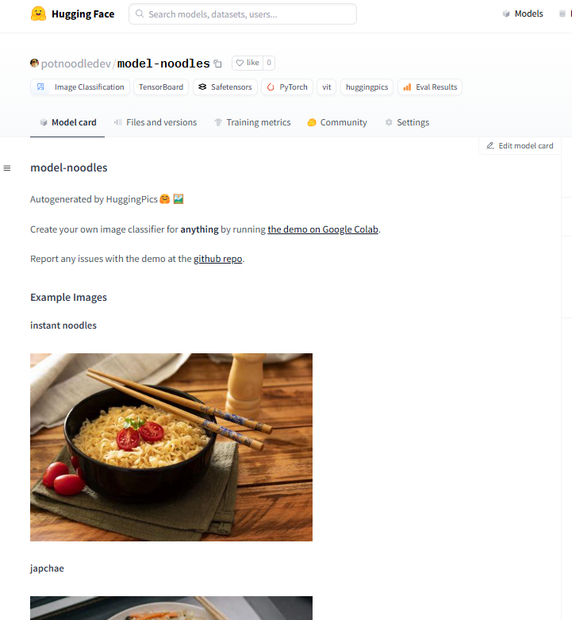

# 🤗🖼️HuggingPics

Fine-tune Vision Transformers for **anything** using images found on the web.

Check out the video below for a walkthrough of this project! ⤵️

## Usage

Click on the link below to try it out:

## How does it work?

### 1. You define your search terms

### 2. We download ~150 images for each and use them to fine-tune a ViT

### 3. You push your model to HuggingFace's Hub to share your results with the world

### Your auto-generated model repo will look something like [this](https://huggingface.co/potnoodledev/model-noodles). Pretty cool, eh? 😎

## Examples

💡 If you need some inspiration, take a look at the examples below:

|            | [potnoodledev/model-noodles](https://huggingface.co/potnoodledev/model-noodles)  | [nateraw/rare-puppers](https://huggingface.co/nateraw/rare-puppers)  | [nateraw/baseball-stadium-foods](https://huggingface.co/nateraw/baseball-stadium-foods) | [nateraw/denver-nyc-paris](https://huggingface.co/nateraw/denver-nyc-paris) |
| ---------- | ------------------------------------------------------------------- | --------------------------------------------------------------------------------- | --------------------------------------------------------------------------------------- | --------------------------------------------------------------------------- |
| **term_1** | instant noodles                                                             | samoyed                                                                             | cotton candy                                                                            | denver                                                                      |
| **term_2** | ramen                                                         | shiba inu                                                                               | hamburger                                                                               | new york city                                                               |
| **term_3** | spaghetti                                                               | corgi                                                                           | hot dog                                                                                 | paris                                                                       |
| **term_4** | pho                                                                    |                                                                                   | nachos                                                                                  |                                                                             |
| **term_5** | japchae                                                                    |                                                                                   | popcorn                                                                                 |                                                                             |

You can see a full list of model repos created using this tool by [clicking here](https://huggingface.co/models?filter=huggingpics)
